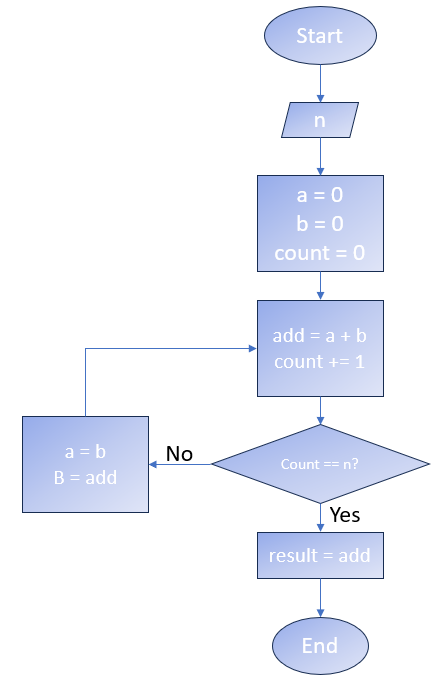
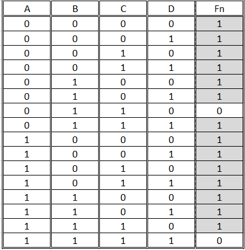
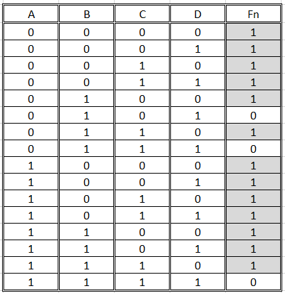

## Logica de Programacion
### Escenario 1

Determina el resultado del diagrama cuando `count = 8`:



//El valor Add suma dos variables vacias (A+B), las cuales nunca son incrementadas debido a que B = Add en lugar de B = Count, por ende, el resultado final deberia permanecer en 0

### Escenario 2
Identifica los errores en el codigo siguiente:

```java 
 
import java.io.*;
 
 //Classes en lugar de Class
class GFG {
    // Function to print N Fibonacci Number
        //Stetic en lugar de Static
    static void Fibonacci(int N)
    {
        int num1 = 0, num2 = 1;
 
        for (int i = 0; i < N; i++) {
            // Print the number
            System.out.print(num1 + " ");
 
            // Swap
            int num3 = num2 + num1;
            //Igualdad, no comparacion
            num1 = num2;
            num2 = num3;
        }
    }
 
    // Driver Code
        //Vacio en español en lugar de ingles
    public static void main(String args[])
    {
        // Given Number N
        int N = 10;
 
        // Function Call
            //Dos argumentos cuando solo se requiere uno
        Fibonacci(N);
    }
}
 

```
## Tablas de verdad
### Escenario

Se te proporcionará una tabla de verdad que describe el comportamiento lógico de una función. Escribe la función booleana simplificada a partir de la tabla (elige cualquiera de las tablas siguientes).


//
Fn = (A'B') + (C'D')



### EXTRA 
Representa el circuito lógico que implementa la función booleana simplificada.

   A ----|>o---- A' \
                       \
                        AND Gate 1 --\
   B ----|>o---- B' /                 \
                                         \ 
                                          OR Gate -- Fn
                                         /
   C ----|>o---- C' \                 /
                       \              /
                        AND Gate 2 --/
   D ----|>o---- D' /

Donde al menos 1 de las parejas no debe de contener un valor positivo 1.

## Linux Test

### Escenario
Se te pidio descargar un binario y ejecutarlo para corroborar que funciona correctamente. Sin embargo, solo tienes acceso al OS desde la linea de comandos. 
Para lograrlo, se te proprocionaron los siguientes comandos:


```bash
$ wget <url>/binary.bin
$ chmod +x binary.bin 
$ ./binary.bin
```

### Ejercicios

En base al escenario anterior, responde los siguientese ejercicios

1. El binario funciona correctamente. Tu mision es moverlo para que sea ejecutable globalmente. Guiate en el siguiente diagrama para realizarlo:

```bash
/📂
├── 📂usr 
│   └── 📁local 
│       └── 📁bin # your binary should be here
└── 📂home 
    └── 📁 user
        └── 📃 binary.bin # your binary is here
```
//Moverse al directorio donde está el binario
cd /home/user

// Mover el binario a /usr/local/bin
sudo mv binary.bin /usr/local/bin

2. Explica que acciones realizan los comandos que elegiste

Primero se debe cambiar el directorio actual a /home/user donde se encuentra binary.bin
Luego de eso, se utiliza mv para mover binary.bin al directorio /usr/local/bin. "sudo" se usa para proporcionar permisos de superusuario necesarios para mover archivos a /usr/local/bin esto debido a que es una carpeta del sistema

### Puntos extra
3. Para que se utiliza el comando `wget`?
Descargar archivos desde la Red.
4. Que cambios realizó el comando `chmod` en el archivo descargado?
El comando chmod +x binary.bin otorga permisos de ejecucion al archivo seleccionado, otorgando la capacidad de ejecutarlo como si de un programa se tratara.